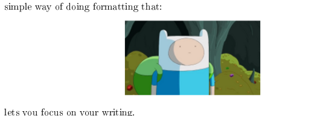

# Going Local

Generating the formats Leanpub does is fairly straightforward [^pdf-exceptions]. Kramdown supports pretty much all
formats via its LaTeX and HTML converters. What is going to be a bit more involved is replicating all the styling
options and workflow Leanpub supports. For that we are going to need to get our hands dirty with a little ruby. 

T> You could if you like skip this chapter and simply download my [krambook](https://github.com/k2052/krambook) gem.
T> I'd recommend you at least skim over the chapter though so you get a basic idea of how to customize a markdown 
T> parser. If you go through all the effort of writing an ebook chances are you are going to want to do at least 
T> some custom stuff. 

## All the Markdown in One

First things first, we need a script that takes our Book.txt, parses the index and then joins all the Markdown files
into one. We can then pass the joined file into Kramdown to get LaTeX back. Why LaTeX? Kramdown doesn't support support
PDF, which means our starting format for PDF generation is always going to be LaTeX. 

We will develop the script to be used from IRB first, then we will wrap it all up as command line script and finally, 
as a gem.

The first thing we need to do is read Book.txt as a string, then split the lines and white space; giving us an array of
files to load and parse.

First some vars to hold things:

{:lang="ruby"}
    files            = []
    joined_file_path = File.expand_path './manuscript/' + 'Joined.md'

Now we need to parse our index file (Book.txt) and get the names of the files:

{:lang="ruby"}
    File.open(File.expand_path('./manuscript/Book.txt'), 'r') do |f|
      f.each_line do |line|
        files << line.gsub(/\s+/, "")
      end
    end

This opens the file for reading, loops through each line, strips the line of whitespace and then adds it to a _files_ 
array.

Now we join all the files and output them into a single Markdown file:

{:lang="ruby"}
    File.open(joined_file_path, 'a') do |f|
      files.each do |file_path|
        full_file_path = File.expand_path '/manuscript/' + file_path
        f.puts ''
        f.puts IO.read(full_file_path) if File.exists?(full_file_path)
      end
    end

This opens an output file in append mode, loops through our files array, reads each file into a new string and appends
the content to the output file.

There is one problem though, we don't check for an existing `Joined.md` file. Let's add a check for that now:

{:lang="ruby"}
    File.delete(joined_file_path) if File.exist?(joined_file_path)

The full ruby script now looks like:

{:lang="ruby"}
    files            = []
    joined_file_path = File.expand_path './manuscript/' + 'Joined.md'
    File.delete(joined_file_path) if File.exist?(joined_file_path)

    File.open(File.expand_path('./manuscript/Book.txt'), 'r') do |f|
      f.each_line do |line|
        files << line.gsub(/\s+/, "")
      end
    end

    File.open(joined_file_path, 'a') do |f|
      files.each do |file_path|
        full_file_path = File.expand_path './manuscript/' + file_path
        f.puts ''
        f.puts IO.read(full_file_path) if File.exists?(full_file_path)
      end
    end

Save the file as `join_manuscript_files.rb` to a folder. Copy over some test content from a Sample Leanpub project and
then boot up irb:

{:lang="sh"}
    $ irb

We can run the script by simply requiring it:

{:lang="ruby"}
    require 'kramdown'
    require './join_manuscript_files.rb'

If you open _Joined.md_ you'll notice one problem, on the very top of the file there will be an extra new line
. We can fix the this by adding a check for the last line to our files loop. T

he files loop now looks like:

{:lang="ruby"}
    files.each do |file_path|
      full_file_path = File.expand_path './manuscript/' + file_path
      f.puts IO.read(full_file_path) if File.exists?(full_file_path)
      f.puts '' unless file_path == files.last
    end

There is a further use case for this joining magic. We can utilize it to convert to another Markdown flavor before
processing. For example, we might be using a slightly different flavor of Markdown and want to pre-process it into
Kramdown first. Instead of just loading the file and joining the strings, we can first parse it though a Kramdown
converter:

{:lang="ruby"}
    f.puts Kramdown::Document.new(IO.read(full_file_path)).to_kramdown if File.exists?(full_file_path)

The script would then look like:

{:lang="ruby"}
    files.each do |file_path|
      full_file_path = File.expand_path './manuscript/' + file_path
      f.puts Kramdown::Document.new(IO.read(full_file_path)).to_kramdown if File.exists?(full_file_path)
      f.puts '' unless file_path == files.last
    end

We can easily swap out formats by changing the `to_format` call e.g the following would output a joined file of LaTeX: 

{:lang="ruby"}
    f.puts Kramdown::Document.new(IO.read(full_file_path)).to_latex if File.exists?(full_file_path)

The does it for now. Later we will wrap this up by creating a gem for the script.

## Creating PDFs

Once we have a joined Markdown file we can turn it into LaTeX and then into a PDF. To turn it into LaTeX we can simply
pass it (the joined file) into the Kramdown command line tool. The Kramdown bin takes two arguments:

{:lang="sh"}
    -i, --input ARG
          Specify the input format: kramdown (default) or html
    -o, --output ARG
          Specify one or more output formats separated by commas: html (default), kramdown, latex or remove_html_tags

T> The Kramdown CLI takes arguments using a single dash and arguments passed to them are designated using two dashes
T> e.g `-o latex --template document`

Kramdown will output to the stdout (the terminal) so we will need to pipe it to a file:

{:lang="sh"}
    $ kramdown Joined.md -o latex > Joined.tex

Now we just need to utilize `pdflatex` to convert LaTeX to PDF. The command for this is simple:

{:lang="sh"}
    $ pdflatex Joined.tex

After running this we will get all sorts of errors:

{:lang="sh"}
    ! LaTeX Error: Missing \begin{document}.
    ...more errors

Open up _Joined.tex_ and you will discover that the LaTeX generated by Kramdown is incomplete; it lacks inclusion
statements for packages, it lacks a begin and end document etc. How do we fix this? Well, it turns out that *kramdown*
uses templates to get wrapping around documents:

{:lang="sh"}
    --template ARG
      The name of an ERB template file that should be used to wrap the output
      
      This is used to wrap the output in an environment so that the output can
      be used as a stand-alone document. For example, an HTML template would
      provide the needed header and body tags so that the whole output is a
      valid HTML file. If no template is specified, the output will be just
      the converted text.
      
      When resolving the template file, the given template name is used first.
      If such a file is not found, the converter extension is appended. If the
      file still cannot be found, the templates name is interpreted as a
      template name that is provided by kramdown (without the converter
      extension).
      
      kramdown provides a default template named 'document' for each converter.
      
      Default: ''
      Used by: all converters

By default, when you convert to LaTeX or html you get fragments. This is useful if you want to add your own wrapping,
e.g when generating an html book or parsing Markdown for blog posts. Personally, I think it would be a good idea to
default to the document template when using Kramdown via cli, but I digress.

To generate a proper LaTeX file we just have to do:

{:lang="sh"}
    $ kramdown Joined.md --template document -o latex > Joined.tex

Opening _Joined.tex_ now reveals a properly formatted file. 

Let's run pdflatex again:

{:lang="sh"}
    $ pdflatex Joined.tex

All appears to have ran correctly! 

Now open the generated pdf:

{:lang="sh"}
    $ xdg-open Joined.pdf

*facepalm* There is a noticeable lack of a table of contents. Now before you consider taking up ebook crafting with a
typesetter and typewriter, let's do some googling, well I'll do the googling, you can just read onward.

It turns out that pdflatex needs to be ran more than once to  generate a proper document. It needs to go through once 
to find all the references, page numbers and footnotes etc, then a second time to add them.

A> pdflatex stores its state and logs in a variety of files in the same directory you run
A> it in. You might consider using a separate output directory, the manuscript folder can get a bit
A> messy otherwise.

## Images and Your PDFs.

Let's see what happens when we add some images. We will include them in our Markdown and then go through the conversion process again.

Add the following (make sure the image is relative to the directory the file is in) to your Markdown:

{:lang="md"}
    

Now run:

{:lang="sh"}
    $ kramdown Joined.md --template document -o latex > Joined.tex

Then:

{:lang="sh"}
    $ pdflatex Joined.tex

Open it up:

{:lang="sh"}
    $ xdg-open Joined.pdf

We get the following output: 

{:center=""}

This is pretty good but there are going to be some cases when we need the image inline, not re-inserted at the top
of the document. First things first, let's figure out what caused this in the TeX file:

{:lang="TeX"}
    Briefly, to write a Leanpub book, you write a bunch of plain text files.....

    \begin{figure}
    \begin{center}
    \includegraphics{images/Finn.png}
    \end{center}
    \caption{Adventure Time}
    \end{figure}

    To learn more about how to write a Leanpub book....

At least to my untrained eyes, it looks like the `\begin{figure}` and `\end{figure}` is the source of the problem. 
Let's manually remove this and regenerate the file to see what happens:

The TeX should now look like:

{:lang="TeX"}
    \begin{center}
    \includegraphics{images/Finn.png}
    \end{center}

I> I removed the caption which was part of figure section.

If we run the conversion again then we get the desired output. Obviously, we cant manually do this every time we add an
image,  so how do we construct our Markdown so it happens automatically? Let's open up `kramdown/converter/latex.rb`
and search for `figure`. 

The source for the `convert_standalone_image` method reveals what is up:

{:lang="ruby"}
    # Helper method used by +convert_p+ to convert a paragraph that only contains a single :img
    # element.
    def convert_standalone_image(el, opts, img)
      attrs = attribute_list(el)
      "\\begin{figure}#{attrs}\n\\begin{center}\n#{img}\n\\end{center}\n\\caption{#{escape(el.children.first.attr['alt'])}}\n#{latex_link_target(el, true)}\n\\end{figure}#{attrs}\n"
    end

The key is the comment:

    Helper method used by +convert_p+ to convert a paragraph that only contains a single :img element.

We need to place this image in a paragraph like so:

{:lang="md"}
    Briefly, to write a Leanpub book, you write a bunch of plain text files,
    all in the same folder as this file. These text files are written in a
    format called Markdown, which is a simple way of doing formatting that
    lets you focus on your writing. 

VS (the figure way):

{:lang="md"}
    Briefly, to write a Leanpub book, you write a bunch of plain text files,
    all in the same folder as this file. These text files are written in a
    format called Markdown, which is a simple way of doing formatting that
    lets you focus on your writing. 

    

After regenerating we get: 

{:center=""}

There are still some problems. First of all, we would like this centered. How can we do that? 

Looking at _Joined.tex_ reveals we have lost our center command:

{:lang="TeX"}
    \includegraphics{images/Finn.png} lets..

Adding it back in like so:

{:lang="TeX"}
    \begin{center}
    \includegraphics{images/Finn.png}
    \end{center}

and then regenerating, results in: 

{:center=""}

We are going to have to rectify this by patching the LaTeX converter to center things automatically.  The syntax for
this will look like:

{:lang="md"}
    {:center=""}

We could simply monkeypatch this onto Kramdown but we want the feature available via cli and to achieve that requires
modifying Kramdown directly. Fork it on github and then change _convert_img_ (in kramdown/converter/latex.rb) to:

{:lang="ruby"}
    def convert_img(el, opts)
      if el.attr['src'] =~ /^(https?|ftps?):\/\//
        warning("Cannot include non-local image")
        ''
      elsif !el.attr['src'].empty?
        @data[:packages] << 'graphicx'
        if el.attr['center']
          "#{latex_link_target(el)}\\begin{center}\\includegraphics{#{el.attr['src']}}\\end{center}"
        else
          "#{latex_link_target(el)}\\includegraphics{#{el.attr['src']}}"
        end
      else
        warning("Cannot include image with empty path")
        ''
      end
    end

Commit and push the changes, then run:

{:lang="sh"}
    $ rake install

A> This will install Kramdown from the repo.
A> 
A> If you are running rbenv make sure you run:
A> 
A> {:lang="sh"}
A>     $ rbenv rehash 
A> 
A> after installing.

Run the whole generation process again:

{:lang="sh"}
    $ kramdown Joined.md --template document -o latex > Joined.tex

Then:

{:lang="sh"}
    $ pdflatex Joined.tex

Open it up:

{:lang="sh"}
    $ xdg-open Joined.pdf

And we get: 

{:center=""}

[^pdf-exceptions]:    
    With the exception of PDF most the ebook formats are rather simple. Most if not all of them are at
    their core just wrappers around html. Even the kindle format is just mobi with Amazon's crap wrapped around it.   
    Once we have HTML + PDF it's pretty damn easy to support everything from that starting point; even if we have to 
    code something ourselves, it will be minimal.
