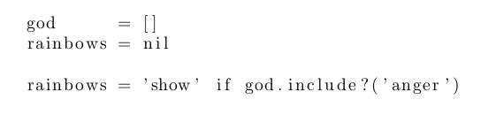
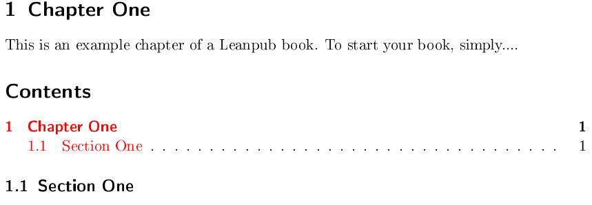
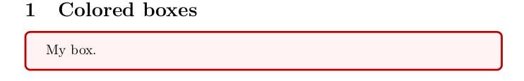
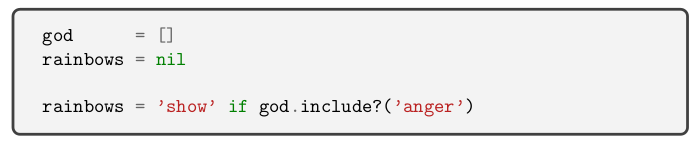

# Common Customizations

Chances are you are going to need to customize some of your output at some point. Thankfully, Kramdown is easily 
extended to add new features. Any customization we make will involve modifying Kramdown in some fashion. We will 
customize the converter not the converted. Customizing things once they're already converted is unmaintainable and 
would destroy all the delight in a work flow.

I> This chapter could be skipped if all you want to do is accomplish the customizations and not learn how they're done
I> All the customizations I made are in my fork of [kramdown](http://github.com/k2052/kramdown) in the 
I> markdown-to-ebook branch just clone and follow the README to install.

## My God, it's full of Snippets

Something completely expected and yet completely unfortunate happens when you write a book on programming, you end up
with a ton of code blocks. Like a redhead from beyond the wall they become difficult to manage, yet, you are somehow 
drawn to them over and over. 

Just when you think you have everything under control your users demand full length source  files. "Copying and pasting
is for those with free time!" "Give us source files!" Your readers shout!  What is an author to do?

Any writer worth his salt preempts this reader rebellion and creates two separate things. He places code examples in
external files and in code blocks. He delicately manages them, keeping them in sync all the time. Inevitably he'll slip
up, one of his  code blocks will contain some random gibberish where he typed `def
igiveupkillmenowcatssalkajddewoq(published='wat')` and then forgot to change it.

A slip-up like this can ruin careers. The author ends up homeless, wearing only Abercrombie & Fitch and coding a whore 
management system for a pimp in the shadiest part of town. He develops a cocaine addiction and ends up dead in a pool 
of his own sweat.

Programmer politicians use his death to advocate for better work circumstances for developers. His tragic story is
covered in major magazines across the country. Cold, heartless, comments are made on Reddit and HN, they say that if
he had only used LaTeX none of this would have happened.

User alevkrf2 writes:
    
    LaTeX has included this functionality for almost a decade. You can just do `\texttt{src/hello.c}` and LaTeX will
    include the file no problem. With a custom macro it is even easier. Something like `\filename{src/hello.c}` isn't 
    hard at all to create.

User throwaway234 replies:

    LaTeX is not a solution period. If you are going to provide LaTeX based solutions you might as well  not be providing a solution at all.

User catsanddogs replies:

    @throwaway234 I personally see nothing wrong with LaTeX. The right tool for the right job. What is your problem 
    with LaTeX?

User throwaway234 replies:

    Oh I don't know, how about that the technology is 2 decades old, comes with confusing documentation,  there are
    like 50 zillion implantations, it throws random tags through my text etc. It's a bastardized language that  tries 
    to be something between turing-complete and plain txt.

User throwaway234 writes:

    *implementations

User kawpo246 replies:

    The things you listed as criticisms are some of the exact reasons others choose LaTeX. old = tried and battle 
    tested. confusing docs = detailed docs for technical users. 

    when you're using this to publish research papers that can change governments and entire economies, something old 
    and thoroughly documented is important. Blank is a prime example of this. A half-turing lang is really a matter of 
    taste and I don't see how it's a relevant criticism. 

User noddywood writes:

    I see these deaths as a worrying trend. How many more deaths do we need before the problem is addressed?

User rubynode.clojure replies:

    @noddywood You are committing a blank blank fallacy. These stats seem large because they get so much    attention, 
    but I just don't see it as a real problem. There is no real evidence it is a real problem. A few outlier   deaths 
    from inappropriate Markdown usage and the ensuing backlash does not make an epidemic.

User dnret writes:

    I think this is inevitable. He should have chosen to write Ruby instead.
    He deserved it.

User dnret writes:

    Why is everyone down voting me?

## Including Source Files With Kramdown

Okay, maybe it wouldn't have been that bad, but you should really learn how to include external files in case something
terrible happens. Out of the box no Markdown processors support this but it is scarily easy to add to Kramdown. Let's
take a look at how.

First, we are going to need to decide on a syntax. We are going to need two things; 

1. A command telling our parser to include a file. 
2. A file attribute that contains the file to be included.

Conveniently, there is a standard implemented by Kramdown already, that defines custom attributes for an element. It
looks like this:

{:lang="md"}
    block
    {:title="The blockquote title"}

Our syntax will thus look like this:

{:lang="md"}
    ~~~ ruby
    ~~~
    {:include="external_file.rb"}

You might want to rush ahead and just implement a custom renderer for Kramdown but we need to consider some things
first. For Leanpub to process things correctly we will need to have our codeblocks possess the actual code in them. If
the Markdown files don't have the actual code in their blocks, then when they're sent to Leanpub they cant be
processed. The only way to make Leanpub happy is pre-process our files and insert the code in the blocks.

This means we need to write two renderers; one that churns out modified Markdown with the code inserted into the
codeblocks and another that simply overrides the LaTeX renderer. This will give us two flexible workflows; one for
Leanpub and one entirely local.

### A Markdown Kramdown Renderer

The first thing we need to do is figure out how a Kramdown renderer works. It might seem complicated, but it's all
pretty straightforward. API wise most (including Kramdown) of the Ruby Markdown renderers borrow from
[Maruku](https://github.com/bhollis/maruku). 

In Maruku the rendering comes down to two tasks;

1. A processor (parser) that turns the Markdown into elements -- into an AST.  
2. Then the rendering class (in Kramdown its called a Converter) is called for each one of these elements. 

Since we already have a codeblock element it's going to be rather easy to grab its attributes, include the file and
return it. We wont have to bother with the parsing bits at all.

The best way to figure out what we need to modify is to look at some of the actual code for converting codeblocks. We
can open kramdown/converter/html.rb and take a look. A quick search in the file for _\_codeblock_ turns up the
following:

{:lang="ruby"}
    def convert_codeblock(el, indent)
      attr = el.attr.dup
      lang = extract_code_language!(attr)
      if @coderay_enabled && (lang || @options[:coderay_default_lang])
        opts = {:wrap => @options[:coderay_wrap], :line_numbers => @options[:coderay_line_numbers],
          :line_number_start => @options[:coderay_line_number_start], :tab_width => @options[:coderay_tab_width],
          :bold_every => @options[:coderay_bold_every], :css => @options[:coderay_css]}
        lang = (lang || @options[:coderay_default_lang]).to_sym
        result = CodeRay.scan(el.value, lang).html(opts).chomp << "\n"
        "#{' '*indent}<div#{html_attributes(attr)}>#{result}#{' '*indent}</div>\n"
      else
        result = escape_html(el.value)
        result.chomp!
        if el.attr['class'].to_s =~ /\bshow-whitespaces\b/
          result.gsub!(/(?:(^[ \t]+)|([ \t]+$)|([ \t]+))/) do |m|
            suffix = ($1 ? '-l' : ($2 ? '-r' : ''))
            m.scan(/./).map do |c|
              case c
              when "\t" then "<span class=\"ws-tab#{suffix}\">\t</span>"
              when " " then "<span class=\"ws-space#{suffix}\">&#8901;</span>"
              end
            end.join('')
          end
        end
        code_attr = {}
        code_attr['class'] = "language-#{lang}" if lang
        "#{' '*indent}<pre#{html_attributes(attr)}><code#{html_attributes(code_attr)}>#{result}\n</code></pre>\n"
      end
    end

This grabs the lang as a symbol, processes it with coderay and returns the HTML. To simplify our job a bit, we are 
going to extend this method rather than recode it. We will parse the attributes for the inclusion, pull the relevant 
file and insert onto the element's content, then we can just call super and let it handle the rest.

First things first, we need to create a class that extends `Kramdown::Converter::Kramdown`:

{:lang="ruby"}
    module Kramdown
      module Converter
        class Includey < ::Kramdown::Converter::Kramdown
          def convert_codeblock(el, indent)
            return super(el, indent)
          end
        end
      end
    end

Now where do we get our include attribute from? My first guess is that we will find it on `el.attr`. We are going
to create some test files and play with them until we figure it out. Once we figure out how to get our attribute
everything else is going to be easy.

Create a new folder for our experimentation to live in and then enter it yourself. Don't live it in it though, there is
nasty fellow named Clue that looks like Jeff Bridges that will attempt to wipe you out. No digitizer necessary, a 
simple `$ cd` will suffice:

{:lang="sh"}
    $ mkdir includey_experiment
    $ cd includey_experiment

Create a markdown file called `test.md` with the following:

{:lang="md"}
    ```ruby
    ```
    {:include="external_file.rb"}

Add a file called `exteneral_file.rb` with some sample ruby:

{:lang="ruby"}
    cats     = 'dog haters'
    penguins = 'ice lovers'
    birds    = 'fluffy soft dinosaurs'

Then create a file for our converter and call it _test.rb_:

{:lang="ruby"}
    require 'kramdown'
    module Kramdown
      module Converter
        class Includey < ::Kramdown::Converter::Html
          def convert_codeblock(el, indent)
            puts el.attr.inspect
            return super(el, indent)
          end
        end
      end
    end

Boot up irb in this directory:

{:lang="sh"}
    $ irb

To use our test converter we just need to require _test.rb_ and then call our converter class.

{:lang="ruby"}
    require './test.rb'
    Kramdown::Document.new(IO.read('./test.md')).to_includey

*ethod_missing* on _Kramdown::Document_ handles instantiating our converter. We should now (hopefully) see some output
in irb:

{:lang="sh"}
    
... Unfortunately, we get nothing. The first thing we need to do is make sure we are using the correct converter
class by `puts`ing the name of whatever is passed to *method_missing*:

{:lang="ruby"}
    module Kramdown
      class Document
        def method_missing(id, *attr, &block)
          if id.to_s =~ /^to_(\w+)$/ && (name = Utils.camelize($1)) && Converter.const_defined?(name)
            puts name.inspect
            output, warnings = Converter.const_get(name).convert(@root, @options)
            @warnings.concat(warnings)
            output
          else
            super
          end
        end
      end
    end

We should see _Includey_ outputted somewhere. 

Now we have to figure out if we are hitting any methods in our converter class. Let's add some more test text to our
Markdown file:

{:lang="md"}
    # Heading

    Paragraph

    # Code sample

    ```ruby
    nemo = 'missing'
    ```

    ```ruby
    ```
    {:include="external_file.rb"}

Override some more methods like this:

{:lang="ruby"}
    def convert_text(el, indent)
      puts 'in text'
      escape_html(el.value, :text)
    end

    def convert_p(el, indent)
      puts 'in p' 
      if el.options[:transparent]
        inner(el, indent)
      else
        format_as_block_html(el.type, el.attr, inner(el, indent), indent)
      end
    end

Run the following again in irb:

{:lang="ruby"}
    require './test.rb'
    Kramdown::Document.new(IO.read('./test.md')).to_includey

And we get back:

{:lang="sh"}
    in text
    in p
    in text
    in text
    in p
    in p

So we are a overriding, we are just not hitting the correct method. Let's try overriding the convert method to see what
elements we are hitting:

{:lang="ruby"}
    # Dispatch the conversion of the element +el+ to a +convert_TYPE+ method using the +type+ of
    # the element.
    def convert(el, indent = -@indent)
      puts el.type
      send(DISPATCHER[el.type], el, indent)
    end

Run this again in irb:

{:lang="ruby"}
    require './test.rb'
    Kramdown::Document.new(IO.read('./test.md')).to_includey

We only get back:

{:lang="sh"}
    root

Well, that is not very helpful. Let's take a shot into the dark and try overriding the codespan method instead:

{:lang="ruby"}
    def convert_codespan(el, indent)
      puts 'in codespan'
      super(el, indent)
    end

Run it again in irb:

{:lang="ruby"}
    require './test.rb'
    Kramdown::Document.new(IO.read('./test.md')).to_includey

{:lang="sh"}
    ...
    in codespan
    ...

And bingo! It seems we overwrote the wrong thing. Duh! Rewrite our _test.rb_ as the following:

{:lang="ruby"}
    require 'kramdown'
    module Kramdown
      module Converter
        class Includey < ::Kramdown::Converter::Html
          def convert_codespan(el, indent)
            puts 'here'
            puts el.attr.inspect
            return super(el, indent)
          end
        end
      end
    end

Then try again:

{:lang="ruby"}
    require './test.rb'
    Kramdown::Document.new(IO.read('./test.md')).to_includey

Now we get back:

{:lang="sh"}
    here
    <kd:codespan "ruby\nnemo = 'missing'\n" nil>
    {}
    here
    <kd:codespan "ruby\n" nil>
    {}

This is interesting, it seems that we don't have any attributes available yet. Let's take a look at the original
_convert_codespan_ and see where it extracts the language. The key line is:

{:lang="ruby"}
    lang = extract_code_language(el.attr)

If we take a look at _extract_code_language_ we find:

    attr['class']

The usage of brackets for accessing elements indicates that _attr_ is a hash or at least hash like. This makes me 
wonder what we have going on in the _attr_. We can probably get an idea if we find the relevant class. Let's inspect 
attr for its class by doing the following:

{:lang="ruby"}
    def convert_codespan(el, indent)
      puts 'in codespan'
      puts el.attr.class
      return super(el, indent)
    end

Run things in irb again:

{:lang="ruby"}
    require './test.rb'
    Kramdown::Document.new(IO.read('./test.md')).to_includey

We get back:

{:lang="sh"}
    in codespan
    Hash

It seems we have a Hash on our hands. Which means, at some point this element is parsed and has its attributes set to
the hash. We need to find that bit of code and see how it works. 

If we go into the _Element_ class we will find the following lines:

{:lang="ruby"}
    # The attributes of the element. Uses an Utils::OrderedHash to retain the insertion order.
    def attr
      @attr ||= Utils::OrderedHash.new
    end

We need to figure out the point where IAL's (Inline Attribute Lists) get turned into attributes. A search through the
code for _IAL_ turns up:

{:lang="ruby"}
    IAL_BLOCK = /\{:(?!:|\/)(#{ALD_ANY_CHARS}+)\}\s*?\n/
    IAL_BLOCK_START = /^#{OPT_SPACE}#{IAL_BLOCK}/

Also a method that parses them:

{:lang="ruby"}
    def parse_block_extensions
      if @src.scan(ALD_START)
        parse_attribute_list(@src[2], @alds[@src[1]] ||= Utils::OrderedHash.new)
        @tree.children << Element.new(:eob, :ald)
        true
      end
    end

The interesting part is the mention of _parse_attribute_list_. Let's inspect that out to stdout:

{:lang="sh"}
    
Well now, there is not much we can do with this, it's ummmm... blank. Where do we go from here? Let's modify the
attributes string in our markdown to look like this:

{:lang="md"}
    # Heading

    Paragraph

    # Code sample

    ```ruby
    nemo = 'missing'
    ```
    {: .language-ruby}

Let's run it again via irb and make sure we are getting class attributes out to our html:

{:lang="html"}
    <h1 id=\"heading\">Heading</h1>\n\n<p>Paragraph</p>\n\n<h1 id=\"code-sample\">Code sample</h1>\n\n<p class=\"language-ruby\"><code>ruby\nnemo = 'missing'\n</code></p>\n

We are, so let's go back to _extract_code_language_ and add the following inspects for debugging:

{:lang="ruby"}
    require 'kramdown'
    module Kramdown
      module Converter
        class Includey < ::Kramdown::Converter::Html
          def convert_codespan(el, indent)
            puts 'here'
            puts el.inspect
            puts el.attr.inspect
            lang = extract_code_language(el.attr)
            puts lang.inspect
            return super(el, indent)
          end
        end
      end
    end

Run it in irb again:

{:lang="ruby"}
    require './test.rb'
    Kramdown::Document.new(IO.read('./test.md')).to_includey

We get:

{:lang="sh"}
    here
    <kd:codespan "ruby\nnemo = 'missing'\n" nil>
    {}
    nil
    => "<h1 id=\"heading\">Heading</h1>\n\n<p>Paragraph</p>\n\n<h1 id=\"code-sample\">Code sample</h1>\n\n<p class=\"language-ruby\"><code>ruby\nnemo = 'missing'\n</code></p>\n"

This indicates our attributes have not yet been parsed. Yet somehow, they end up in our output. It must be happening in
the last line! Let's take a look at _format_as_span_html_:

{:lang="ruby"}
    # Format the given element as span HTML.
    def format_as_span_html(name, attr, body)
      "<#{name}#{html_attributes(attr)}>#{body}</#{name}>"
    end

Bazinga! Seems `html_attributes` is what we are looking for. Let's take a look at it:

{:lang="ruby"}
    # Return the HTML representation of the attributes +attr+.
    def html_attributes(attr)
      attr.map {|k,v| v.nil? || (k == 'id' && v.strip.empty?) ? '' : " #{k}=\"#{escape_html(v.to_s, :attribute)}\"" }.join('')
    end

WAT! It just does a map against the attr -- how in the world do we end up with the class on our element then? I mean
it's right there just look:

{:lang="html"}
    <p class=\"language-ruby\"><code>ruby\nnemo = 'missing'\n</code></p>\n

It's at this moment when you realize what you had missed all along. Everything comes back around and everything makes
sense. Like at the end of a great crime thriller you can see all the connections. You shout: "it was the guy with the 
gimp all along! He was in the crowd with the civilians! The killer was the, omg I knew it, but I didn't, I'm 
surprised, but I'm not. I could feel it coming."

It's the best kind of feeling to finally _see_ but it's the worst kind of feeling because you know you missed so much.

What did I miss? Way back when I started this I was using the wrong syntax. We got codespans not codeblocks because I
was using the wrong syntax. The dead ringer should have been the output of the _ruby_ language code into the block.

We are back on the right track though. We can see clearly now.

Let's modify the Markdown to look like this:

{:lang="md"}
    # Heading

    Paragraph

    # Code sample

    ~~~ ruby
    nemo = 'missing'
    ~~~
    {:include='external_file.rb'}


And our ruby like this:

{:lang="ruby"}
    require 'kramdown'
    module Kramdown
      module Converter
        class Includey < ::Kramdown::Converter::Html
          def convert_codeblock(el, indent)
            puts 'in codeblock'
            puts el.attr.inspect
            return super(el, indent)
          end
        end
      end
    end

Run in irb again:

{:lang="ruby"}
    require './test.rb'
    Kramdown::Document.new(IO.read('./test.md')).to_includey

And we get:

{:lang="sh"}
    in codeblock
    {"class"=>"language-ruby", "include"=>"external_file.rb"}

We are now getting our attributes. What we have to do now is modify the content with the external file. Let's do the
following:

{:lang="ruby"}
    require 'kramdown'
    module Kramdown
      module Converter
        class Includey < ::Kramdown::Converter::Html
          def convert_codeblock(el, indent)
            if el.attr.include?('include')
              file_path = File.expand_path(Dir.pwd + '/' + el.attr['include'])
              el.value  = IO.read(file_path) if File.exists?(file_path)
            end

            return super(el, indent)
          end
        end
      end
    end

Run it in irb again:

{:lang="ruby"}
    require './test.rb'
    Kramdown::Document.new(IO.read('./test.md')).to_includey

We get back the following HTML:

{:lang="html"}
    <h1 id=\"heading\">Heading</h1>\n\n<p>Paragraph</p>\n\n<h1 id=\"code-sample\">Code
    sample</h1>\n\n<div include=\"external_file.rb\"><div class=\"CodeRay\">\n  <div
    class=\"code\"><pre><span class=\"line-numbers\"><a href=\"#n1\" name=\"n1\">1</a></span>cats     =
    <span style=\"background-color:hsla(0,100%,50%,0.05)\"><span style=\"color:#710\">'</span><span
    style=\"color:#D20\">dog haters</span><span style=\"color:#710\">'</span></span>\n<span class
    =\"line-numbers\"><a href=\"#n2\" name=\"n2\">2</a></span>penguins = <span style=\"background-
    color:hsla(0,100%,50%,0.05)\"><span style=\"color:#710\">'</span><span style=\"color:#D20\">ice
    lovers</span><span style=\"color:#710\">'</span></span>\n<span class=\"line-numbers\"><a
    href=\"#n3\" name=\"n3\">3</a></span>birds    = <span style=\"background-
    color:hsla(0,100%,50%,0.05)\"><span style=\"color:#710\">'</span><span style=\"color:#D20\">fluffy
    soft dinosaurs</span><span style=\"color:#710\">'</span></span>\n</pre></div>\n</div>\n</div>\n 

Bingo! Now the next step is to build a parser that renderers Markdown files with the code included. This should be
really straightforward. All we need to do is a return a Markdown file from Kramdown which we can then re-save to an
output directory. To do this we need to first inherit from the `Kramdown` converter:

{:lang="ruby"}
    require 'kramdown'
    module Kramdown
      module Converter
        class Includey < ::Kramdown::Converter::Kramdown
          def convert_codeblock(el, indent)
            if el.attr.include?('include')
              file_path = File.expand_path(Dir.pwd + '/' + el.attr['include'])
              el.value  = IO.read(file_path) if File.exists?(file_path)
            end

            return super(el, indent)
          end
        end
      end
    end

Save as `test_md_render.rb` and then run with:

{:lang="ruby"}
    require './test_md_render.rb'
    Kramdown::Document.new(IO.read('./test.md')).to_includey

No we get back:

{:lang="md"}
    # Heading\n\nParagraph\n\n# Code sample\n\n    cats     = 'dog haters'\n    penguins = 'ice lovers'\n    birds    = 'fluffy soft dinosaurs'\n{: .language-ruby include=\"external_file.rb\"}\n\n

This is close but it's missing the code block tags. This could be for one of two reasons; 

1. Kramdown prefers indented blocks of code and it's stripping them out in the super method of
`convert_codeblock`
2. We are replacing it when we push the file contents onto el.value.

To test this, let's remove the grabbing of files from the method so it looks like:

{:lang="ruby"}
    def convert_codeblock(el, indent)
      return super(el, indent)
    end

Then we can test again:

{:lang="ruby"}
    require './test_md_render.rb'
    Kramdown::Document.new(IO.read('./test.md')).to_includey

We get back:

{:lang="md"}
    # Heading\n\nParagraph\n\nCode sample\n\n    nemo = 'missing'\n{: .language-ruby
    # include=\"external_file.rb\"}\n\n

This means Kramdown is stripping it out. We have a few options; 

1. Live with this format. 
2. Override the parent method. 
3. Look for a configuration option. 

Living with it is easy and can be covered in a single 300 page book called "Living with it". Coming to Oprah's reading
book club this fall. 

I digress. Let's take a look at the source for the super function in Kramdown:

{:lang="ruby"}
    def convert_codeblock(el, opts)
      el.value.split(/\n/).map {|l| l.empty? ? "    " : "    #{l}"}.join("\n") + "\n"
    end

Looks like the value is split on and then some padding inserted. This means the tags for the element,  the three `~`
thingies, they are not used at all. We can override and add them back by doing:

{:lang="ruby"}
    def convert_codeblock(el, indent)
      if el.attr.include?('include')
        file_path = File.expand_path(Dir.pwd + '/' + el.attr['include'])
        el.value  = IO.read(file_path) if File.exists?(file_path)
      end

      el.value.split(/\n/).map {|l| l.empty? ? "    " : "    #{l}"}.join("\n") + "\n"
    end

Run it like this:

{:lang="ruby"}
    require './test_md_render.rb'
    s = Kramdown::Document.new(IO.read('./test.md')).to_includey
    File.write('out.md', s)

Open up `out.md` and you should have:

{:lang="md"}
    # Heading

    Paragraph

    # Code sample

    ~~~ ruby
    cats     = 'dog haters'
    penguins = 'ice lovers'
    birds    = 'fluffy soft dinosaurs'
    ~~~
    {: .language-ruby include="external_file.rb"}

We are pretty much good to go now. Have fun!

## Including Source Files With Pandoc

Pandoc doesn't have the ability to include source files built in but it's fairly easy to add.
Just use the following code:

{:lang="haskell"}
    -- includes.hs
    import Text.Pandoc

    doInclude :: Block -> IO Block
    doInclude cb@(CodeBlock (id, classes, namevals) contents) =
      case lookup "include" namevals of
           Just f     -> return . (CodeBlock (id, classes, namevals)) =<< readFile f
           Nothing    -> return cb
    doInclude x = return x

    main :: IO ()
    main = getContents >>= bottomUpM doInclude . readMarkdown def
                       >>= putStrLn . writeMarkdown def

The syntax to make use of this looks like this:

{:lang="md"}
    {include="external_file.rb"}
    this will be replaced by external_file.rb

That is it. 

## Including Files via LaTeX

In principle, this is quite straightforward and involves a single command, but in practice it's not quite so simple.

First, we need to install the _listings_ package. If you're on Ubuntu do the following:

{:lang="sh"}
    $ sudo apt-get install texlive-extra-utils 

Let's test to see if is working. Do the following: 

{:lang="sh"}
    $ mkdir test_text_including_external_files
    $ cd test_text_including_external_files
    $ touch test_include_external_file.tex
    $ touch external_file.rb

Add some contents to our external ruby file:

{:lang="ruby"}
    god      = []
    rainbows = nil

    rainbows = 'show' if god.include?('anger')

    longrubylinesolongitwhaswrappingissues = 'Not rapping issues but wrapping issues. Like if Santa had issues you know'

Now add the following to the tex file:

{:lang="tex"}
    \usepackage{listings}
    \lstinputlisting{external_file.rb}

Open it with gummi:

{:lang="sh"}
    $ gummi test_include_external_file.tex

Now we get an error page in Gummi. Click on the build log (should also be in stdout if you ran gummi through terminal)
tab and you should see:

{:lang="sh"}
    (/usr/share/texlive/texmf-dist/tex/latex/base/article.cls
    Document Class: article 2007/10/19 v1.4h Standard LaTeX document class
    (/usr/share/texlive/texmf-dist/tex/latex/base/size10.clo))
    (/tmp/gummi_S8ZDXW.aux) [1{/var/lib/texmf/fonts/map/pdftex/updmap/pdftex.map}]
    (/tmp/gummi_S8ZDXW.aux) )</usr/share/texlive/texmf-dist/fonts/type1/public/amsf
    onts/cm/cmr10.pfb></usr/share/texlive/texmf-dist/fonts/type1/public/amsfonts/cm
    /cmr12.pfb></usr/share/texlive/texmf-dist/fonts/type1/public/amsfonts/cm/cmr17.
    pfb>
    Output written on /tmp/gummi_S8ZDXW.pdf (1 page, 38476 bytes).
    Transcript written on /tmp/gummi_S8ZDXW.log.

This is telling us that we need declare a document class first. Let's do that:

{:lang="tex"}
    \documentclass{article}
    \usepackage{listings}
    \begin{document}
    \lstinputlisting{external_file.rb}
    \end{document}

We get: 

{:center=""}

It would be nice to get some syntax highlighting. We can get this by using Minted. Minted is a package for LaTeX that
wraps pygments and makes it available to LaTeX. First we need to make sure we have pygments installed.

A> If you think you have pygments installed but are not sure then run:
A> 
A> {:lang="sh"}
A>     $ pygmentize

You can install pygments by doing the following:

*On Ubuntu*

{:lang="sh"}
    $ sudo apt-get install python-pygments

*On Mac*

{:lang="sh"}
    $ sudo easy_install Pygments

After you have installed create a file called minted.tex:

{:lang="sh"}
    $ touch minted.tex

To use _minted_ do the following:

{:lang="tex"}
    \documentclass{article}
    \usepackage{minted}
    \begin{document}
    \inputminted{ruby}{external_file.rb}
    \end{document}

Open with gummi and see the results:

{:lang="sh"}
    $ gummi minted.tex

We get back an error image. If we view the build log we can see the problem:

{:lang="sh"}
    This is pdfTeX, Version 3.1415926-2.4-1.40.13 (TeX Live 2012/Debian)
     \write18 enabled.
    entering extended mode
    (./.minted.tex.swp
    LaTeX2e <2011/06/27>
    Babel <v3.8m> and hyphenation patterns for english, dumylang, nohyphenation, lo
    aded.
    (/usr/share/texlive/texmf-dist/tex/latex/base/article.cls
    Document Class: article 2007/10/19 v1.4h Standard LaTeX document class
    (/usr/share/texlive/texmf-dist/tex/latex/base/size10.clo))

    ! LaTeX Error: File `minted.sty' not found.

    Type X to quit or <RETURN> to proceed,
    or enter new name. (Default extension: sty)

    Enter file name: 
    ./.minted.tex.swp:3: Emergency stop.
    <read *> 
             
    l.3 \begin
              {document}^^M
    ./.minted.tex.swp:3:  ==> Fatal error occurred, no output PDF file produced!
    Transcript written on /tmp/.minted.tex.log.

The key line is:

{:lang="sh"}
    ! LaTeX Error: File `minted.sty' not found.

This is telling us that minted is not installed. Let's try to install via apt, because I'm lazy and you should be to;
laziness = productiveness.

We can search for the minted package by doing:

{:lang="sh"}
    $ apt-cache search minted

We get back the following:

{:lang="sh"}
    texlive-latex-extra - TeX Live: LaTeX supplementary packages

Bingo! Or as the IT kids say these days, "0118 999 881 999 119 725 3"! Let's install it using the following lines of
magic:

{:lang="sh"}
    $ sudo apt-get install texlive-latex-extra

Once installed we can run gummi again:

{:lang="sh"}
    $ gummi minted.tex

And finally we get back: !(External File Code Block Highlighting With Wrapping Issues](images/ExternalFilesLaTeXMintedWrappingIssues.png){:center=""}

You may notice a problem that I have so far glossed over, line wrapping issues. Unfortunately, there is a not solution
to this without some heavy hacking of minted. Instead we have two options;

1. We can just manually wrap lines inserting a good old `\` or just by re-organizing until the 
  line is shorter. 
2. We can customize _Listings_ to use colors. 

Let's do the latter. We have to start by configuring Listings which we do with the `lstset` macro.

{:lang="tex"}
    \documentclass{article}

    \usepackage[T1]{fontenc}

    \usepackage{color}
    \definecolor{bluekeywords}{rgb}{0.13,0.13,1}
    \definecolor{greencomments}{rgb}{0,0.5,0}
    \definecolor{redstrings}{rgb}{0.9,0,0}

    \usepackage{listings}
    \lstset{language=Ruby,
      breaklines=true,
      showstringspaces=false,
      commentstyle=\color{greencomments},
      keywordstyle=\color{bluekeywords},
      stringstyle=\color{redstrings},
      basicstyle=\ttfamily
    }

    \begin{document}
    \lstinputlisting{external_file.rb}
    \end{document}

What we have done is set some colors for things like keywords, strings and comments. This results in the following:

{:center=""}

How do we add this to our output in a Markdown to LaTeX workflow though? There are a few different ways but the 
simplest and the one keeping most in line with our way of doings things so far is to use a template. Instead of passing
`--template document` to kramdown we will create our own and pass the full file path in the arguments.

Let's open `kramdown/data/kramdown/document.latex`. We will be presented with a relatively simple erb template

{:lang="erb"}
    <%
    encmap = {
      'UTF-8' => 'utf8x',
      'US-ASCII' => 'ascii',
      'ISO-8859-1' => 'latin1',
      'ISO-8859-2' => 'latin2',
      'ISO-8859-3' => 'latin3',
      'ISO-8859-4' => 'latin4',
      'ISO-8859-5' => 'latin5',
      'ISO-8859-9' => 'latin9',
      'ISO-8859-10' => 'latin10',
      'CP850' => 'cp850',
      'CP852' => 'cp852',
      'CP858' => 'cp858',
      'CP437' => 'cp437',
      'CP865' => 'cp865',
      'CP1250' => 'cp120',
      'CP1252' => 'cp1252',
      'CP1257' => 'cp1257'
    }
    %>
    \documentclass{scrartcl}
    <% if RUBY_VERSION >= '1.9' %>
    \usepackage[<%= encmap[@body.encoding.name] %>]{inputenc}
    <% else %>
    \usepackage[mathletters]{ucs}
    \usepackage[utf8x]{inputenc}
    <% end %>
    \usepackage[T1]{fontenc}
    \usepackage{listings}
    <% @converter.data[:packages].each {|pkg| %>\usepackage{<%= pkg %>}
    <% } %>
    \usepackage{hyperref}

    <% if @converter.data[:packages].include?('fancyvrb') %>
    \VerbatimFootnotes
    <% end %>

    \hypersetup{colorlinks=true,urlcolor=blue}

    \begin{document}
    <%= @body %>
    \end{document}

We are already including listings so all we need to do is add `lstset` after the `usepackages` like this:

{:lang="erb"}
    ....

    <% if @converter.data[:packages].include?('fancyvrb') %>
    \VerbatimFootnotes
    <% end %>

    \lstset{language=Ruby,
      breaklines=true,
      showstringspaces=false,
      commentstyle=\color{greencomments},
      keywordstyle=\color{bluekeywords},
      stringstyle=\color{redstrings},
      basicstyle=\ttfamily
    }

Save this someplace and then pass it to Kramdown with the template argument. For example;

{:lang="sh"}
    $ kramdown --template customtemplate.erb.latex

That will do it. Enjoy!

## Generating a Table of Contents

Generating a table of contents in Kramdown is straightforward but there are a few practical problems you can run into. 
Before we examine how it works in Kramdown let's take a look at how it works as LaTeX.

I> You'll have to build the PDF twice for the Table of Contents Page to appear. Remember, it takes multiple passes for
I> LaTeX to build up its output. One pass to get all the sections and headings then another to generate it.

Open a generated Joined.tex and you should see something like:

{:lang="tex"}
    \documentclass{scrartcl}

    \usepackage[utf8x]{inputenc}

    \usepackage[T1]{fontenc}
    \usepackage{listings}
    \usepackage{graphicx}

    \usepackage{hyperref}

    \hypersetup{colorlinks=true,urlcolor=blue}

    \begin{document}
    \section{Chapter One}\hypertarget{chapter-one}{}\label{chapter-one}

    This is an example chapter of a Leanpub book. To start your book, simply....

    \subsection{Section One}\hypertarget{section-one}{}\label{section-one}

    \end{document}

Adding a table of contents page is straightforward, we just need to use the relevant command. It looks like this:

{:lang="tex"}
    \begin{document}
    \tableofcontents
    ...

I'm not skimping on commands here, all you need to do is call `\tableofcontents` to get a generated TOC. LaTeX will
build up its table of contents after parsing all the sections, and then it will insert the table of contents where the
command is called.

Running pdflatex against this results in the following PDF: 

{:center=""}

Of course we cant be manually inserting this command every time we regenerate LaTeX. We are going to have to get
Kramdown to do it for us. Kramdown handles table of contents without any modifications. How do we generate a TOC page 
though? Let's find out by opening `kramdown/converter/latex.rb`. Searching for _\tableofcontents_
reveals that the TOC is generated when the appropriate options are set:

{:lang="ruby}
    if !@data[:has_toc] && (el.options[:ial][:refs].include?('toc') rescue nil)

This is telling us that if we add an attribute called _toc_ to a list it will be replaced with the
call to `\tableofcontents`. For example:

{:lang="md"}
    * Will be replaced with the ToC, excluding the "Contents" header
    {:toc}

Running this through Kramdown results in the following LaTeX:

{:lang="tex"}
    \documentclass{scrartcl}

    \usepackage[utf8x]{inputenc}

    \usepackage[T1]{fontenc}
    \usepackage{listings}
    \usepackage{graphicx}

    \usepackage{hyperref}

    \hypersetup{colorlinks=true,urlcolor=blue}

    \begin{document}
    \section{Chapter One}\hypertarget{chapter-one}{}\label{chapter-one}

    This is an example chapter of a Leanpub book. To start your book, simply....

    \tableofcontents
    \subsection{Section One}\hypertarget{section-one}{}\label{section-one}

    \end{document}

And the following PDF: 

{:center=""}

That is it!

## Custom thing a ma bobs.

You've seen them before, the custom little framed boxes of content. Maybe they look this:

{:center=""}

Now you're thinking, I'd really like to build some boxes like that; to create notes, colored backgrounds and little
icons. How do we do this on the limited Markdown language spec? The answer is extensions. The syntax for Markdown
extensions uses an opening and ending tag that looks like this:

{:lang="md"}
    {::comment}
    This is a comment which is
    completely ignored.
    {:/comment}

We need to do one thing to make this flexible enough for our needs. We need to modify the _handle\_extension_ method in
_kramdown/parser/kramdown/extensions.rb_ so it handles any named extension. 

Change the last else in the method to the following:

{:lang="ruby"}
    else
      @tree.children << Element.new(name.to_sym, body, nil, :category => type) if body.kind_of?(String)
      true
    end

Then we can just define the method on our converter class:

{:lang="ruby"}
    def convert_comment(el, opts)
      el.value.split(/\n/).map {|l| "% #{l}"}.join("\n") + "\n"
    end

The first thing we need is the LaTeX for creating these boxes. We are going to use a package aptly called `tcolorbox`.
The syntax is rather simple and looks like:

{:lang="tex"}
    \begin{tcolorbox}[options]
      My box.
    \end{tcolorbox}

We will simply use the default options for now. Let's create a simple example document that loads some code up into a
box:

{:lang="tex"}
    \documentclass{article}
    \usepackage{tikz,lipsum,minted}
    \usepackage[listings,theorems,skins]{tcolorbox}

    \begin{document}
    \begin{tcolorbox}
      \inputminted{ruby}{external_file.rb}
    \end{tcolorbox}
    \end{document}

Saving and running that doc through pdflatex results in the following: 

{:center=""}

If you need line breaks you can do:

{:lang="tex"}
    \documentclass{article}
    \usepackage{tikz,lipsum}
    \usepackage[listings,theorems,skins]{tcolorbox}

    \usepackage[T1]{fontenc}

    \usepackage{color}
    \definecolor{bluekeywords}{rgb}{0.13,0.13,1}
    \definecolor{greencomments}{rgb}{0,0.5,0}
    \definecolor{redstrings}{rgb}{0.9,0,0}

    \usepackage{listings}
    \lstset{language=Ruby,
      breaklines=true,
      showstringspaces=false,
      commentstyle=\color{greencomments},
      keywordstyle=\color{bluekeywords},
      stringstyle=\color{redstrings},
      basicstyle=\ttfamily
    }

    \begin{document}
    \begin{tcolorbox}
    \lstinputlisting{external_file.rb}
    \end{tcolorbox}
    \end{document}

That is it for the LaTeX bit. Now for the Markdown bit.

We need a Markdown extension that generates this, let's call it _tcolorbox_. The Markdown to use it would then look 
like this:

{:lang="md"}
    {::tcolorbox}
    code here
    {:/tcolorbox}

We only have one problem to resolve, how do we support any type of content in our blocks? The answer is simple, we just
parse what is in the block as a separate document and run _to_latex_ on it. This allows us to put any arbitrary 
Markdown we want in the block.

The code for this is rather simple:

{:lang="ruby"}
    def convert_tcolorbox(el, opts)
      @data[:packages] << 'tcolorbox' unless @data[:packages].include?('tcolorbox') # Add the package
      "\\begin{tcolorbox} #{::Kramdown::Document.new(el.value).to_latex} \\end{tcolorbox}"
    end

Now we add this method to our Kramdown fork and re-build/re-install the gem.

When we run a test document:

{:lang="md"}
    {::tcolorbox}
    # Heading

    Paragraph.

    *bold*
    {:/tcolorbox}

We get the following LaTeX:

{:lang="tex"}
    \documentclass{scrartcl}

    \usepackage[utf8x]{inputenc}

    \usepackage[T1]{fontenc}
    \usepackage{listings}
    \usepackage{tcolorbox}

    \usepackage{hyperref}

    \hypersetup{colorlinks=true,urlcolor=blue}

    \begin{document}
    \begin{tcolorbox} \section{Heading}\hypertarget{heading}{}\label{heading}

    Paragraph.

    \emph{bold}

     \end{tcolorbox}
    % This is a comment which is
    % completely ignored.

    \end{document}

And the resulting PDF is: 

{:center=""}

## A key binding awaits

The days before `<kbd>` were a dark time for the web.  It was a time without clear shortcuts. A time when keys went
unstyled and blended into the text, never to be seen, like a secret agent behind a cactus. It was a time when
instructions where easily missed and humans were easily frustrated. Then came the kbd and  the presentation of 
shortcuts was changed for ever.

No longer were replies to questions limited by the styles of plain text. The world had 
a new tag and a whole new world was opened up to it.

Heading back to the dark ages for PDF's sake is not an option. We have to bring the future to PDFs. How do we do this?
First things first, we have to know the LaTeX it takes to build this. Thankfully, there is a package called _menukeys_
that will handle all our kbd needs.

We use menukeys like this:

{:lang="tex"}
    \documentclass{article}
    \usepackage[T1]{fontenc}
    \usepackage{menukeys}
     
    \begin{document}
    Keyboard shortcut for saving the file and the world: \keys{\cmd+\shift+S}
    \end{document}

This results in the following output: 

{:center=""}

Now we need to add support for kbd to our Markdown. Markdown supports html tags so all we have to do is just use the 
kbd tag and then transform it into the relevant LaTeX. We could invent our own tag but using the html one makes it 
easy to support html and thus html based ebook formats.

Add the following Markdown to a test doc:

{:lang="md"}
    Keyboard shortcut for saving the file and the world: <kbd>cmd</kbd> + <kbd>shift</kbd> + <kbd>S</kbd>

When we run Kramdown against this Markdown we will get the following error:

{:lang="sh"}
    Warning: Can't convert HTML element

If we search for _"Can't convert HTML element"_ in _kramdown/converter/latex.rb_ we will find a method called
_convert\_html\_element_:

{:lang="ruby"}
    def convert_html_element(el, opts)
      if el.value == 'i'
        "\\emph{#{inner(el, opts)}}"
      elsif el.value == 'b'
        "\\emph{#{inner(el, opts)}}"
      else
        warning("Can't convert HTML element")
        ''
      end
    end

Adding support for _kbd_ should be rather straightforward. We will need an if statement and something that appends the
menukeys package to `@data[:packages]`. 

The following should do:

{:lang="ruby"}
    elsif el.value == 'kbd'
      @data[:packages] << 'menukeys' unless @data[:packages].include?('menukeys') # Add the package
      "\\keys{#{inner(el, opts)}}"

Make the modification to a Kramdown fork and then run:

{:lang="sh"}
    $ rake install
    $ rbenv rehash # Optional use only if rbenv is installed

to update your Kramdown binary in rubygems.

That is it!
