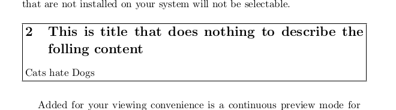

# All the features of Leanpub

Leanpub has a few nifty doodads that will be useful in the generation of our documents. Things like; code includes,
asides, warning blocks, info blocks and death rays. With the exception of that last one (who needs a death ray when you
have a... I've said too much.) they're all extremely useful. If you use Leanpub to publish your book in the early 
phases then you might become dependent on them and need to replicate them or risk a terrible 48 hours of detoxing in a 
dark room. Not to worry, you can replicate Leanpub features as easily as Tyrell Corp replicates.

## Move Aside

Most of the Leanpub extensions to Kramdown utilize angle brackets to indicate things. If you want a sidebar you'd do 

{:lang="md"}
    A> This is a sentence or in an aside

Or if you wanted a warning box with an icon you'd do:

{:lang="md"}
    W> This is a warning about the end of the world and the beginning of whimpers

To replicate these type of _tags_ we will need two things;

1. A parser for the tag.
2. A convert method that takes that block and turns it into an output string. 

Let's look at a parser to see how one is built. Open up `kramdown/parser/kramdown/blockquote.rb`:

{:lang="ruby"}
    BLOCKQUOTE_START = /^#{OPT_SPACE}> ?/

    # Parse the blockquote at the current location.
    def parse_blockquote
      result = @src.scan(PARAGRAPH_MATCH)
      while !@src.match?(self.class::LAZY_END)
        result << @src.scan(PARAGRAPH_MATCH)
      end
      result.gsub!(BLOCKQUOTE_START, '')

      el = new_block_el(:blockquote)
      @tree.children << el
      parse_blocks(el, result)
      true
    end
    define_parser(:blockquote, BLOCKQUOTE_START)

The parser defines itself by passing a name and Regex to the `define_parser` method. The Regex (`BLOCKQUOTE_START`)
simply looks for a space (optional) followed by a right angle bracket and another space which is made optional by the
`?` mark. The parser class iterates over defined parsers and when it reaches something that matches `BLOCKQOUTE_START`
it passes off the parsing to the matching method.

The parser method turns the content of the block into an element and then returns true to the parser
so it knows the element has been added to the element tree. It also moves a string scanner along until all the content for the block is parsed so the parser doesn't hit this block again. 

This is typical behavior for most parsers. Most parsers consist of two main parts; 

1. A string scanner that moves along parsing things using simple matching. 
2. Something that turns the strings into an element tree (AST) which is later converted to final output by dedicated output classes.

To accomplish the parsing bits for an aside we only need to duplicate the blockquote parser and tweak the Regex slightly. Create a new file called `kramdown/parser/aside.rb` with the following contents:

{:lang="ruby"}
    require 'kramdown/parser/kramdown/blank_line'
    require 'kramdown/parser/kramdown/extensions'
    require 'kramdown/parser/kramdown/eob'

    module Kramdown
      module Parser
        class Kramdown

          ASIDE_START = /^#{OPT_SPACE}A> ?/

          # Parse the aside at the current location.
          def parse_aside
            result = @src.scan(PARAGRAPH_MATCH)
            while !@src.match?(self.class::LAZY_END)
              result << @src.scan(PARAGRAPH_MATCH)
            end
            result.gsub!(ASIDE_START, '')

            el = new_block_el(:aside)
            @tree.children << el
            parse_blocks(el, result)
            true
          end
          define_parser(:aside, ASIDE_START)

        end
      end
    end

The only significant change is to the Regex. It now looks for an `A` fellowed by an angle bracket `>`.
The next step is to add a `convert_aside` to the HTML and LaTeX converter classes. Let's start with the HTML
conversion.

First we need to determine what Markup to utilize for an aside. We could easily craft this ourselves but we risk
running into compatibility issues with ePub readers. We should stick to what is known to work. We can open up the
generated HTML from [^export-html] Leanpub and pull the Markup and the CSS for asides.

The html for an aside is:

{:lang="html"}
    

    

Now we just need to add a convert method that returns this. Open up `kramdown/converter/html.rb` and add a method called `convert_aside`:

{:lang="ruby"}
    def convert_aside(el, indent)
    end

We still need to do two things; 

1. Wrap the body in the markup. 
2. Make sure we parse the contents of the block so we can use things like codeblocks inside an aside.

First step:

{:lang="ruby"}
  result = "
"
  result << '
'

We now have a wrapper div. Now let's add a call to inner() to pull the content:

{:lang="ruby"}
    result = "
"
    result << inner(el, indent)
    result << '
'

The final method now looks like:

{:lang="ruby"}
    def convert_aside(el, indent)
      result = "
"
      result << inner(el, indent)
      result << '
'
    end

That does it for the html portion. Now how do we get asides in our PDFs? We will need a LaTeX package that
constructs something similar. There is package called fancybox that will allow us to construct simple boxes that very closely resemble the Leanpub asides. The LaTeX for it looks like this: 

{:lang="TeX"}
    \fbox{%
    \begin{minipage}{\textwidth}
    \section{This is title that does nothing to describe the folling content}
    Cats hate Dogs
    \end{minipage}}

This results in a box that looks like this: 

{:center=""}

This is a bit tight and could use some padding and the left margin removed. We can add padding using `\vspace` and
remove margins using `\noident`. The LaTeX will then look like:

{:lang="TeX"}
    \vspace{5 mm}
    \noindent
    \fbox{%
    \begin{minipage}{\textwidth}
    \section{This is title that does nothing to describe the folling content}
    Cats hate Dogs
    \end{minipage}}
    \vspace{5 mm}

When processed it looks like: 

{:center=""}

Now we just need to get this added to our LaTeX converter. Open up `kramdown/converter/latex.rb` and add a `convert_aside` method:

{:lang="ruby"}
    def convert_aside(el, opts)
    end

Append the package to packages:

{:lang="ruby"}
    @data[:packages] << 'fancybox' unless @data[:packages].include?('fancybox') # Add the package

Add the wrap string:

{:lang="ruby"}
    result = <<-eos
      \vspace{5 mm}
      \noindent
      \fbox{%
      \begin{minipage}{\textwidth}
    eos

Process the el's content through inner:

{:lang="ruby"}
    result << inner(el, opts)

Then close the string: 

{:lang="ruby"}
    result << <<-eos
      \end{minipage}}
      \vspace{5 mm}
    eos

The final method looks like:

{:lang="ruby"}
    def convert_aside(el, opts)
      @data[:packages] << 'fancybox' unless @data[:packages].include?('fancybox') # Add the package
      result = <<-eos
        \vspace{5 mm}
        \noindent
        \fbox{%
        \begin{minipage}{\textwidth}
      eos

      result << inner(el, opts)

      result << <<-eos
        \end{minipage}}
        \vspace{5 mm}
      eos
    end

[^export-html]:      
    To get html you can either utilize the export html feature (found in your book's actions tab) or
    open the ePub (an ePub is actually just a zip of html files) and grab the HTML from there.

## Icons

Leanpub provides warning, information, tips, error, discussion icon blocks etc. They all look pretty much the same and
consist of an icon on the left with some text on the right. They look like this:

W>## This is a Warning
W>
W> Warnings are generated by using `W>` at the beginning of lines.

All are implemented pretty much in the same manner, so we will only focus on implementing one: The information block.
First we need to open up some generated html and get the markup for it:

{:lang="html"}
    <table class="information sidebarish">
      <tbody>
        <tr>
          <td class="sidebar-icon"></td>

          <td>
          </td>
        </tr>
      </tbody>
    </table>

Next we will add a parser for it. Create a file called `infoblock.rb` in `kramdown/parser/kramdown` with the following
contents:

{:lang="ruby"}
    module Kramdown
      module Parser
        class Kramdown

          INFOBLOCK_START = /^#{OPT_SPACE}I> ?/

          # Parse the aside at the current location.
          def parse_infoblock
            result = @src.scan(PARAGRAPH_MATCH)
            while !@src.match?(self.class::LAZY_END)
              result << @src.scan(PARAGRAPH_MATCH)
            end
            result.gsub!(INFOBLOCK_START, '')

            el = new_block_el(:infoblock)
            @tree.children << el
            parse_blocks(el, result)
            true
          end
          define_parser(:infoblock, INFOBLOCK_START)

        end
      end
    end

Now open up `convert/html.rb` and add a method for converting an infoblock:

{:lang="ruby"}
    def convert_infoblock(el, indent)
      result = <<-eos <table class="information sidebarish">
        <tbody>
          <tr>
            <td class="sidebar-icon"></td>
            <td>
      eos

      result << inner(el, indent)

      result << <<-eos      
              </td>
            </tr>
          </tbody>
        </table>
      eos
    end

If we want to do this for LaTeX we can utilize a package called *notes* that supports everything from information to
warning notes. To construct an information note we use the following:

{:lang="TeX"}
    \begin{informationnote}
    Informative information about Penguins. Everything you need to know to survive an attack from an angry flightless 
    bird.
    \end{informationnote}

Now we just need to add this to the LaTeX converter. Open up `kramdown/converter/latex.rb` and add a `convert_infoblock`
method:

{:lang="Ruby"}
    def convert_infoblock(el, opts)
      @data[:packages] << 'notes' unless @data[:packages].include?('notes') # Add the package
      result = '\\begin{informationnote}'

      result << inner(el, opts)

      result << '\\end{informationnote}'
    end

That is it!

You can repeat the process detailed in this section for any of the other types of note blocks.

## Includes like Leanpub

We have already made a converter for including snippets but it just so happens that Leanpub has it's own syntax for this. You can include a sample file like this:

{:lang="md"}
    <<(code/sample1.rb)

Replicating this syntax won't be too hard we just leverage our previous code for including samples and combine it with 
a custom parser. First create a new file in `kramdown/parser/` and call it `includeblock.rb`. Place the following 
inside its bowels:

{:lang="Ruby"}
    require 'kramdown/parser/kramdown/blank_line'
    require 'kramdown/parser/kramdown/extensions'
    require 'kramdown/parser/kramdown/eob'

    module Kramdown
      module Parser
        class Kramdown

          INCLUDEBLOCK_START = /^#{OPT_SPACE}<</
          INCLUDEBLOCK_MATCH = /^#{OPT_SPACE}<<\((.*)\)/

          # Parse the aside at the current location.
          def parse_includeblock
            result = @src.scan(INCLUDEBLOCK_MATCH)
            result.gsub!(INCLUDEBLOCK_START, '')
            result.gsub!('(', '')
            result.gsub!(')', '')

            el = new_block_el(:includeblock)
            @tree.children << el
            parse_blocks(el, result)
            true
          end
          define_parser(:includeblock, INCLUDEBLOCK_START)

        end
      end
    end

Now open up `kramdown/converter/html.rb` and add a converter method for include blocks.

{:lang="Ruby"}
    def convert_includeblock(el, indent)
      file_path        = File.expand_path(Dir.pwd + '/' + el.value)
      el.value         = IO.read(file_path) if File.exists?(file_path)
      el.attr['class'] = "language-#{File.extname(file_path)}" if File.exists?(file_path)
      
      convert_codeblock(el, indent)
    end

This takes the file path; attempts to load the file if it exists, adds a language class based on the ext name and then
finally passes the file contents off to `convert_codeblock` for processing.

Since we are utilizing `convert_codeblock` for the final transformation, the method is the exact same for the LaTeX
converter. Just copy it on over.

## Make the code blocks detect their language

You can make codeblocks detect their language from the lang attribute by overriding the `convert_codeblock` method
and pulling the language from attribute and then inserting it into onto the class attribute:

{:lang="ruby"}
  def convert_codeblock(el, indent)
    el.attr['class'] = "language-#{el.attr['lang']} #{el.attr['class']}" if el.attr.include?('lang')
    super(el, indent)
  end

Now your codeblocks will be properly highlighted. 

## Use pygments with Kramdown

This is really straightforward but I thought it worth including instructions and a snippet anyway.
Override the `convert_codeblock` method and change its contents to the following:

{:lang="ruby"}
    def convert_codeblock(el, indent)
      attr   = el.attr.dup
      lang   = extract_code_language!(attr)
      result = Pygments.highlight(code, :lexer => lang)

      "#{' '*indent}<div#{html_attributes(attr)}>#{result}#{' '*indent}
\n"
    end

That is it! I told you it was really straightforward.

W> Make sure you have required the _pygments_ gem at some point.
