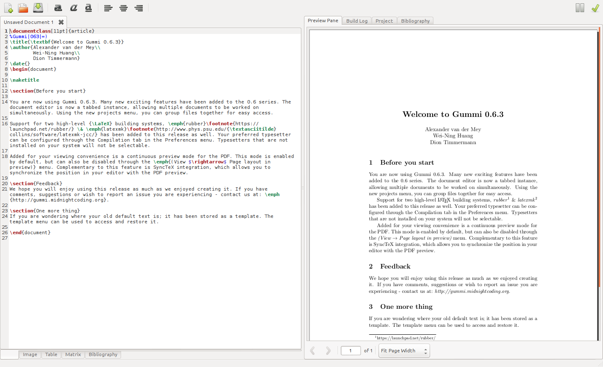

# LaTeXing

It's no good being tied completely to Leanpub for publishing. Eventually we will want someway to locally generate
all the formats that Leanpub does. We have already covered generating HTML locally, but what about PDFs? 

Kramdown doesn't support PDFs natively, it uses an in-between format called LaTeX. So before we get started on
converting Markdown to PDFs we are going to have to learn some LaTeX. LaTeX knowledge is not strictly necessary
but it's going to be beneficial to know how the magic works.

Magic is great and makes things easier, but when it fails, and you don't know how it works, frustration finds its way
into your soul. Frustration kills the desire to create and will leave you a sad, bleeding, heaving mess on the floor.
Probably not that graphic, but it's terrible, trust me.

Let's avoid some future frustration and learn a little LaTeX.

## Installing LaTeX 

Before you dive in there are some things you need to know. The LaTeX community is a bit bloated.  Well, maybe "a bit" 
is an understatement, LaTeX makes Photoshop seem like an anorexic. This bloat is the result of the community being 
really old in software years -- TeX is older than I am. As a result of its age, LaTeX has accumulated a ton of stuff. 

LaTeX standard distributions are measured in the gigabytes! It has more GUIs than a Windows development community, more
packages than a Ruby community and an outdated package distribution model that makes Macports seem like homebrew. TeX 
is what happens when an emacs-esque community spends its time writing technical papers and doesn't have VIM fights to 
keep them busy.

Bloat in distributions alone wouldn't be so bad but the documentation is bloated as well.  Want to add code
highlighting? There are a million different solutions and a million different suggestions. Want a GUI for previewing?
Pick one of dozens. Want an implementation that is more turing complete? Do you want your turing in LaTeX, Lua, or 
Ruby?

I'm going to simplify things and tell you what to use. You don't have to ultimately follow my suggestions, but stick
with them until you figure out what you're doing. Fight the urge to over evaluate and pick the best solutions. Without
knowledge you won't be able to evaluate anything. Choosing from a place of ignorance is an exercise in futility. You'll
find that by diving in, you'll discover what you like -- what your taste in tools is; you'll ultimately discover what
works for you.

### On Mac

As much as I'd like to recommend you use a package manager like homebrew or macprots to keep TeX up to date, it's not a
good idea. Unfortunately, using homebrew would cause more problems with bugs and compatibility issues than you'd gain
from using it. The best way (and the official way) is to install LaTeX + TeX from [mactex.org](http://tug.org/mactex).
Just follow the instructions and you should be good to go.

### On Ubuntu (and other Debians) 

Installing LaTeX on Ubuntu is pretty straightforward and essentially involves running the following:

{:lang="sh"}
    $ sudo apt-get install texlive

We will need a GUI for previewing the results. For this, we will use Gummi. Gummi is simpatico with the Markdown
philosophy of keeping previewing separate from editing. It includes separate tabs and panels for previewing, editing,
and examining the build log from `pdflatex`. It looks like this: 

{:center=""}

Get started by running the following:

{:lang="sh"}
    $ sudo apt-get install gummi

APT will install the necessary prerequisites from the texlive package. Once installed, we can
proceed by getting up to speed with a test document. Open Gummi and you'll be presented with a test
document.

## Installing LaTeX Packages on Mac

There is no management of LaTeX packages on Mac. To install them you either use _MacTeXtras_ from
[mactex.org](http://tug.org/mactex) or manually copy them into your LaTeX path.

## Installing LaTeX Packages on Ubuntu (and other Debians)

Ubuntu (and other Debian based distros) don't have tlmgr (the LaTeX package manager) and you will use _apt_ to manage
LaTeX packages. You might be thinking: "This is ugly and stupid. I mean, Ruby has games, Lua has luarooks, Python has
peepee, Cocoa has Cocaine Pods, even PHP has something I cant remember the name of [^all-the-names]. Why cant LaTeX get
with the times?"

LaTeX's package manager is unfortunately more like apt than a LaTeX package manager and would cause conflicts if
utilized on Debian installs. If it was available it would do all sorts of screwy things to your system.

Not to worry though, there are gigantic repos [^facetious] of all the LaTeX packages you could ever want included in
apt. You can find them by searching for them:

{:lang="sh"}
    $ apt-cache search texlive

To search for a specific package (in this example `listings`) do:

{:lang="sh"}
    $ apt-cache search listings

Here are some things you'll probably want to install:

{:lang="sh"}
    texlive-extra-utils       - TeX Live: TeX auxiliary programs
    texlive-font-utils        - TeX Live: Graphics and font utilities
    texlive-fonts-extra       - TeX Live: Extra fonts
    texlive-fonts-recommended - TeX Live: Recommended fonts

Install them with:

{:lang="sh"}
    $ sudo apt-get install texlive-extra-utils      
    $ sudo apt-get install texlive-font-utils       
    $ sudo apt-get install texlive-fonts-extra  
    $ sudo apt-get install texlive-fonts-recommended

[^all-the-names]: 
    Gems for ruby, luarocks for lua, pypy for python, pear + composer for php, CocoaPods for cocoa respectively.

[^facetious]:      
    I'm being facetious. It's really not that big of a deal and works quite efficiently. It could be
    better but it could also be way way worse. It's not like you will [see below] need to manage multiple versions of
    LaTeX for different books. Unlike say a Ruby app, your final deliverable is more 
    like a creation of art than it is programming. Users don't care what version of LaTeX you used to generate your PDF
    . Well, unless they're one of those PDF version snobs god I hate those guys. They even have their own hats and 
    handshakes now.

## Using Packages

To use a package simply do the following:

{:lang="TeX"}
    \usepackage{packagename}

For example:

{:lang="TeX"}
    \usepackage{listings}

[ctan.org](http://www.ctan.org) is the place to lookup packages. 

That is about all you need to know to get up and running. Have fun and break things.

## LaTeX: A Very Brief Introduction

The first thing you need to know to grok LaTeX is that everything is done using back-slash tags -- everything, yes,
everything. They look like this; `\title`, `\document`, `\newpage` etc. These _tags_ are referred to as *commands*
remember that, it's important for googling.

To pass an argument to a command we use braces e.g `\title{On the speed of Unladen Swallows in Vacuums}`. LaTeX 
uses two different syntaxes for arguments, one for optional arguments and one required arguments. Content that will be operated on is passed via curly braces and the other arguments are passed via brackets e.g:
`\textbf[Mono, 10pt]{BOld It}`. Each required argument ends up in it's own curly brace like this: `\begin{arg}{arg}`.
Arguments in the curly braces are required and ones in brackets are optional.

Intuitively, you're likely to think about LaTeX like you would a text markup language; tags being processed one
after another and the output being inserted in their place. You can avoid a lot of frustration if you think of LaTeX
more like a programming language than a markup language. Although LaTeX isn't turing complete [^turing-completeness], 
it can do a lot of crazy, very flexible, powerful, unexpected things.

Here is a quick example to give you a basic understanding of the programming nature of LaTeX:

{:lang="TeX"}
    \documentclass{article}
     
    \title{Mein Dark Side: On The Struggle of Ruling the Galaxy and Baking Cookies}
    \author{Darth Vader}
    \date{\today{}}
     
    \begin{document}
    \maketitle

    In a galaxy far far away. Okay, no cliche starts. I meant in a planet far far away. Or on a planet? Yeah, it was on a
    planet. I'm sure of it. Or maybe some of the people were one the planet? And the others were like in it? Maybe, the
    people in it (the planet) had gone crazy because of light deprivation? Like, they became cannibals and stuff.
     
    \end{document}

The first command:

{:lang="TeX"}
    \documentclass{article}

Tells LaTeX to treat this as an _article_ type. 

Then we set some metadata:

{:lang="TeX"}
    \title{Mein Dark Side: On The Struggle of Ruling the Galaxy and Baking Cookies}
    \author{Darth Vader}
    \date{\today{}}

This wont be displayed until we call the commands that output it. You can think of the above commands like variables.
A corresponding command has to be called later to output a variable. Much like a php _echo_ or a ruby _puts_.

Open the document and call \maketitle to insert a properly formatted title:

{:lang="TeX"}
    \begin{document}
    \maketitle
    \end{document}

This results in the following output: 

{:center=""}

A mixture of programming and markup language is a bit strange at first but very powerful once you get the hang of it. A
LaTeX document can be used to build articles, books, generate citations, hit lists (not recommended), html pages, table
of contents etc. There are commands and packages for accomplishing practically any sort of output.

I'm not going to focus much on the commands available in LaTeX. Once you know the syntax you can learn the commands on 
a need to know basis. Whenever you need a new command google it. Don't understand a command? Look up its 
documentation.

[^turing-completeness]: 
  I lied. Technically LaTeX is turing complete. However, in practice using LaTeX as a programming language is near 
  impossible, its syntax simply isn't suited to it. There are however implementations that are programming friendly; 
  [LuaTeX](http://luatex.org) is the most popular one.

## Custom LaTeX Styles

There are two types of things you can use to customize LaTeX. Style files, with the extension `.sty` and class files
with the extension `.cls`.

Style files, unlike their css brethren in the HTML world, do a lot more than handle styles. They're basically a
collection of anything LaTeX. You can put macros, styles, commands etc in them and then reuse them as packages later.

They look a little like this:

{:lang="TeX"}
    \NeedsTeXFormat{LaTeX2e}[1994/06/01]
    \ProvidesPackage{custom}[2013/05/13 Custom Package]

    \newcommand{\cats}{}

    \endinput

- *\NeedsTeXFormat{...}* Says I need this LaTeX version or I will destroy your TeX and make it look like barf. 
- *\ProvidesPackage* Does what it says i.e details what the package is. The name ("custom") must match the filename without the extension. 
- *\endinput* You must close the package with this.

To use them you just call the `\usepackage` command:

{:lang="TeX"}
    \usepackage{custom} 

The package must be in your LaTeX path. Where your LaTeX path is, I have no idea. Probably
where you last left it? Retrace your steps? I digress.

Depending on your installation the LaTeX path is whatever `$ kpsewhich -var- value=TEXMFHOME` tells you. 

What is _kpsewhich_? I'll let the docs tell you:

{:lang="sh"}
    Standalone path lookup and expansion for Kpathsea.
    The default is to look up each FILENAME in turn and report its
    first match (if any) to standard output.

Ah, good old _Kpathsea_. I've been Kpathing since I was a wee little child. Actually no, but your sarcasm detector saw
that coming. 

So, what is Kpathsea? Do I dare type `$ kpathsea` and risk falling further down the rabbit hole? I'm expecting a
definition like:

{:lang="sh"}
    Standalone path tool and creator for Kpath

Let's brave the man anyway and see what we come up with:

{:lang="sh"}
    $ kpathsea
    zsh: command not found: kpathsea

Thank god it's something revealing. I feel like I'm learning the secrets of the Kpathsea universe. What wonders abound
I wonder? Will I discover the secret to immortality? The properties of God? The formula for a new face enrichment 
cream?

A quick google reveals the following:

    ## Kpathsea

    Kpathsea is a library to do path searching. It is used in the Web2C implementation of TeX and friends. 

[^cream]

Aha! Kpathsea does exactly what path and your shell accomplish. Which actually makes sense, because TeX came before
modern shells. TeX was first and had to invent its own stuff. Imagine how different documentation would have been had
Kpathsea become a standard. Just a reminder to append rbenv shims to your Kpathsea. Okay, I digress.

We wont use packages for our purposes, but it's a good idea that we now know the basics of how they
work. Now about those classes.

You know that line we see at the beginning of every LaTeX document? The one that looks like: 

{:lang="TeX"}
    \documentclass{scrartcl}

This tells the document to use that class. A class can be an; article, report, paper, book etc. A book class might have
macros for Chapter and Covers. An article class might have commands for references, indexes, footnotes etc.

A class looks like this:

{:lang="TeX"}
    \NeedsTeXFormat{LaTeX2e}
    \ProvidesClass{myclass}[2013/5/5 My Class]

    %% Load base class
    \LoadClass[a4paper]{article}

    \endinput

Pretty much the same as a package but with a slightly different definition syntax. 

One can completely change the look and appearance of a document just by changing its class. With classes alone you can
create everything from slides which look awesome, to books, which look like what you're reading now.

Yes, I said slides. They look like: 

{:center=""}

They are created with code like:

{:lang="TeX"}
    \documentclass{beamer}

    \begin{document}
      \begin{frame}
        \frametitle{This is the first slide}
        %Content goes here
      \end{frame}
      \begin{frame}
        \frametitle{This is the second slide}
        \framesubtitle{A bit more information about this}
        %More content goes here
      \end{frame}
    % etc
    \end{document}

Classes open up a whole range of options for completely customizing the output of a document. The possibilities are
beyond the scope of this book but I encourage you to go forth into the internets and learn.

[^cream]:      
    Markdown added for effect. The original was HTML which was quite boring and verbose. Grow up Chrome, learn
    a real markup language like Markdown. Quick thought to ponder: What if the web was a simple text based language instead of XML? Would we have had near the level of innovation? Would flash still dominate site creation?
